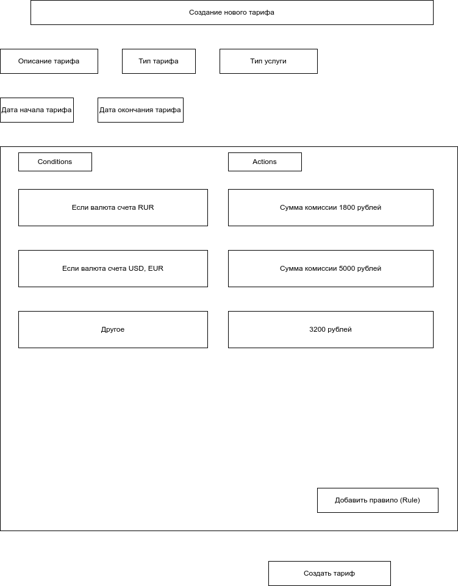

# tariff-management-otus-kotlin

Учебный проект курса Kotlin Backend Developer - 28.12.2022

Название проекта - Разработка системы управления тарифами.

Описание проекта - предполагается разработать систему, позволяющую организациям гибко управлять тарификацией своих услуг, автоматизировать процесс тарификации. Например, в банковской деятельности применяется тарифный сборник, включающий около 500 различных тарифов по предоставляемых баноком услугам (комиссии за открытие счета, за закрытие счета, за ведение счета, тарифы за проведение разного рада ручных операций, за переводные операции и т.п). Система может включать в себя несколько модулей - собственно модуль по созданию и ведению тарифов, модуль со статистиками (сумма комиссии по тарифу может зависеть от различных факторов. Например, от остатков, оборотов, количества операций и т.п.), модуль подключения тарифов к тарифицируемым сущностям (клиент, счет, номер телефона, адрес, ...), модуль-шаблонизатор

## Визуальная схема фронтенда

## Документация

1. Маркетинг
    1. [Заинтересанты](./docs/01-marketing/01-stakeholders.md)
    2. [Целевая аудитория](./docs/01-marketing/02-target-audience.md)
    3. [Пользовательские истории](./docs/01-marketing/03-user-stories.md)
2. DevOps
    1. [Схема инфраструктуры](./docs/02-devops/01-infrastruture.md)
    2. [Схема мониторинга](./docs/02-devops/02-monitoring.md)
3. Тесты
4. Архитектура
    1. [Компонентная схема](./docs/04-architecture/01-arch.md)
    2. [Интеграционная схема](./docs/04-architecture/02-integration.md)
    3. [Описание API](./docs/04-architecture/03-api.md)
